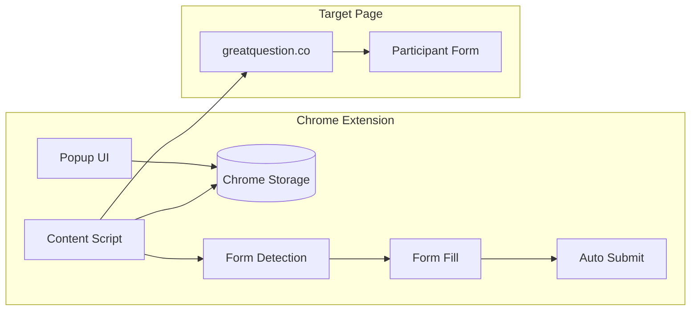

# GQ Party Streamliner - Chrome Extension Plan

## Architecture Overview



## File Structure

```
gq-party-streamliner/
├── manifest.json          # Extension manifest (v3)
├── popup/
│   ├── popup.html         # Settings UI
│   ├── popup.css          # Styling
│   └── popup.js           # Settings logic
├── content/
│   ├── content.js         # Form detection & filling
│   └── wordlist.js        # Word lists for readable random strings
├── icons/
│   ├── icon16.png
│   ├── icon48.png
│   └── icon128.png
└── README.md              # Installation instructions for team
```

## Core Components

### 1. Settings (Popup UI)

Settings stored in `chrome.storage.sync`:

- `namePrefix` - default: "Test" (works out of the box)
- `emailUsername` - **required** - no default (e.g., "mark")
- `emailDomain` - **required** - no default (e.g., "greatquestion.co")
- `urlPatterns` - default patterns that work out of the box:
  ```
  *://greatquestion.co/*/*/direct*
  *://greatquestion.co/*/*/bookings/new*
  *://greatquestion.co/*/*/external/apply*
  ```

- `autoSubmit` - boolean toggle (default: off)
- `enabled` - master on/off toggle (default: on)

### 2. Form Detection Logic

The content script will validate a form by checking for:

1. An input with `id="name"` or `name` containing "name" (type="text")
2. An input with `id="email"` or `type="email"`
3. At least one checkbox with `id` containing "consent"

This ensures we only fill legitimate GQ participant forms, not random forms on the page.

### 3. Random String Generation

Human-readable format: `{adjective}-{noun}-{number}`

- Example: "sunny-tiger-42", "swift-river-17"
- Adjectives: ~50 common positive/neutral words
- Nouns: ~50 common objects/animals
- Number: 10-99 (2 digits)

### 4. Form Filling Behavior

When a matching form is detected:

**If email IS configured:**

1. Fill name field: `{namePrefix} {randomString}` (e.g., "Test sunny-tiger-42")
2. Fill email field: `{emailUsername}+{randomString}@{emailDomain}` (e.g., "mark+sunny-tiger-42@greatquestion.co")
3. Check all consent checkboxes that aren't already checked
4. If `autoSubmit` enabled, click the submit button immediately

**If email is NOT configured:**

1. Fill name field only: `{namePrefix} {randomString}`
2. Check consent checkboxes
3. Inject a small dismissible banner at top of form:

> "Email not configured. [Open extension settings](#) to enable full auto-fill."

   - Clicking the link opens the extension popup via `chrome.runtime.openOptionsPage()` or similar

4. Auto-submit is **disabled** (even if toggle is on) - user must manually submit

### 5. URL Pattern Matching

Support simple glob patterns converted to regex:

- `*` matches any characters
- Default patterns (works out of the box):
  - `*://greatquestion.co/*/*/direct*` - direct booking pages
  - `*://greatquestion.co/*/*/bookings/new*` - new booking pages  
  - `*://greatquestion.co/*/*/external/apply*` - external apply pages
- Users can add/remove patterns as needed in settings

## Distribution for Non-Technical Team

Create a simple README with:

1. Download/unzip instructions
2. Navigate to `chrome://extensions`
3. Enable "Developer mode"
4. Click "Load unpacked" and select the folder
5. Configure settings via extension popup

Optionally: Include a 30-second Loom-style walkthrough link placeholder.

## Implementation Notes

- Uses Manifest V3 (required for modern Chrome)
- Content script runs on `document_idle` to ensure form is loaded
- Uses `chrome.storage.sync` so settings sync across devices
- No external dependencies - pure vanilla JS for simplicity and easy maintenance
